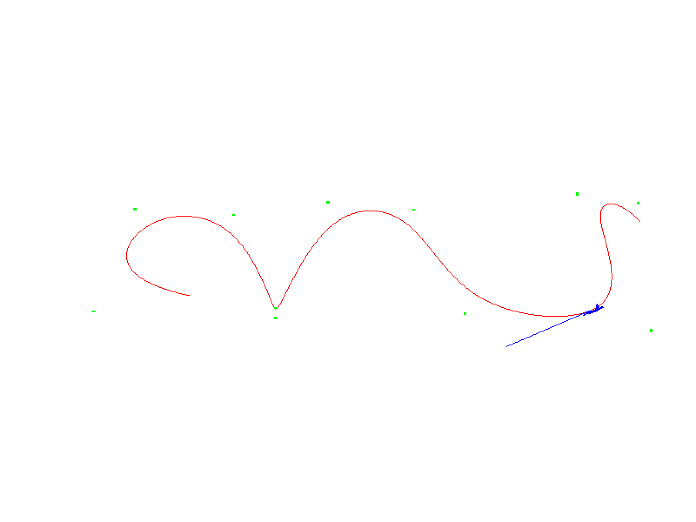
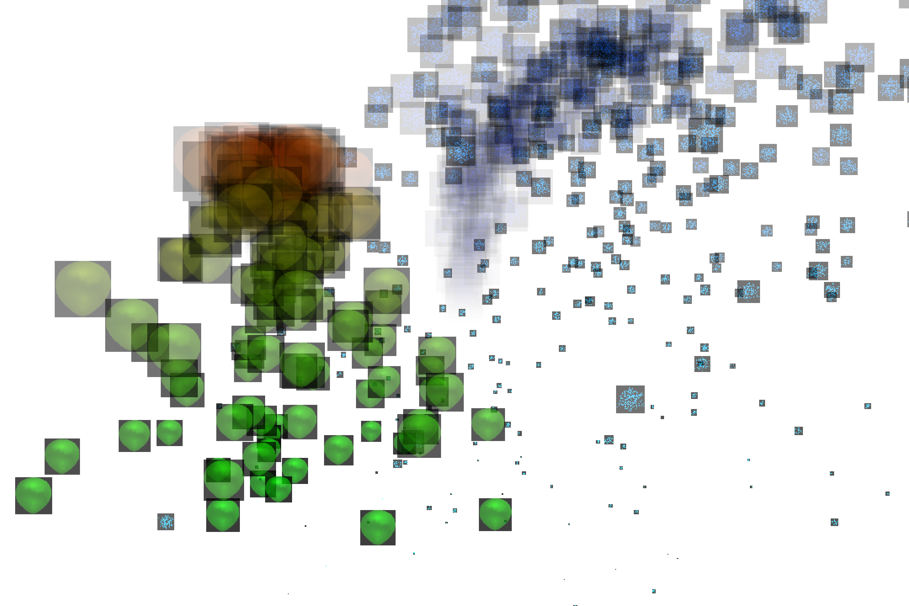
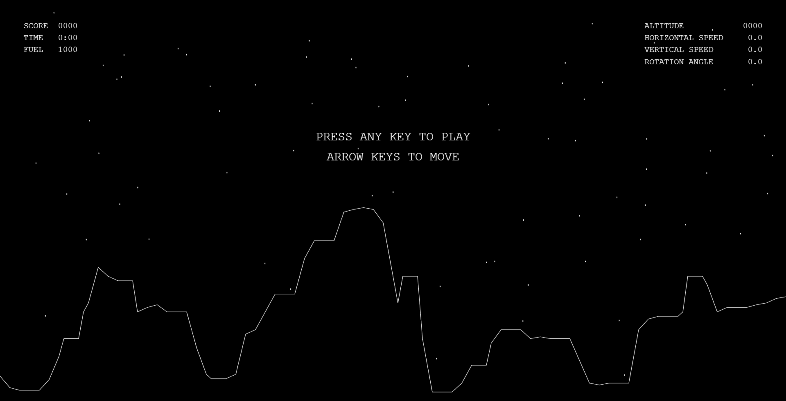
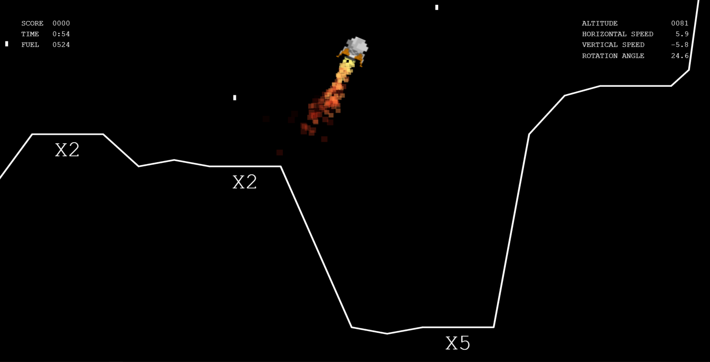
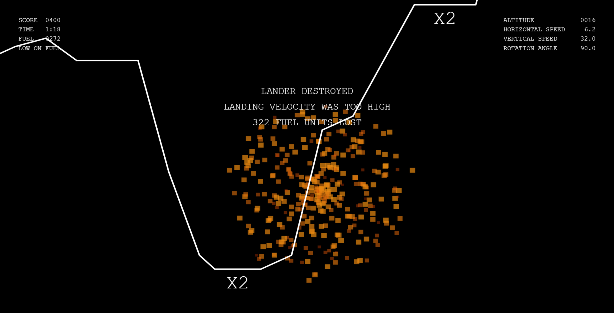

# Computer graphics lab

This repository was mandatory for the [Computer graphics](https://www.fer.unizg.hr/en/course/comgra_a)/[Computer animation](http://www.zemris.fer.hr/predmeti/ra/index.html) course.  

## lab1 - B-spline

Comparison of DCM and axis-angle rotation on B-spline trajectories.  

  

Requires:

* glm
* glut

## lab2 - Particle systems

Basic particle systems with billboarding.  

  

Requires:

* glm
* glut
* stb_image

## project - Moonlander

JavaScript arcade game inspired by Lunar Lander.

Separate repository [here](https://github.com/tblazevic/moonlander).  

  

  

  
